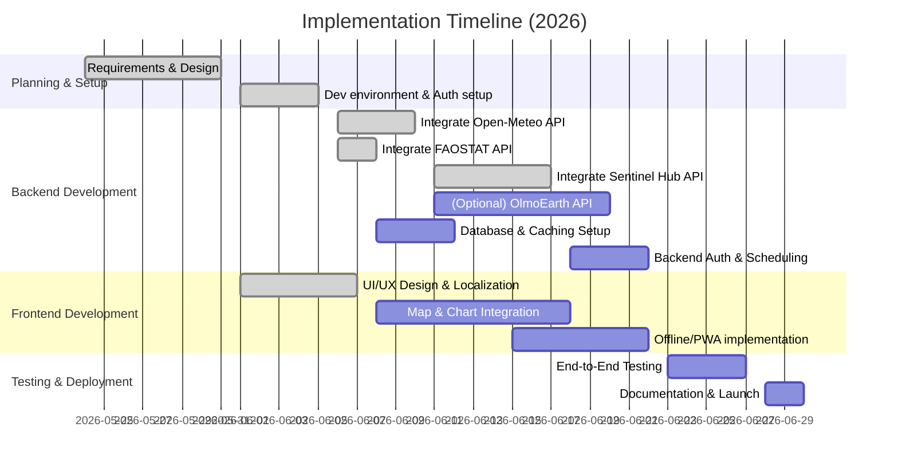

# Executive Summary

This report surveys four data platforms and APIs – **Open-Meteo**, **OlmoEarth (AI2)**, **FAOSTAT**, and **Sentinel Hub** – for building a web app to support Ghanaian smallholder farmers. Each platform is examined for available data (e.g. rainfall, temperature, soil moisture, NDVI, crop statistics), spatial/temporal coverage (all offer global coverage including Ghana), data access methods (API endpoints, authentication, formats) and licensing/cost. We discuss integration steps, provide sample requests and code snippets (JavaScript and Python), and highlight limitations and use-case applications (e.g. planting dates, drought alerts, yield estimates) for Ghana. 

We also propose a full‑stack architecture tailored to Ghana’s context – a mobile-first web frontend (React or similar with PWA/offline support) connecting to a lightweight backend (Node.js/Express or Python Flask) and a simple spatial database (PostGIS or SQLite), all hosted on low-cost cloud services (e.g. Vercel/Netlify, Heroku/GitHub Codespaces, AWS Free Tier) and using open-source tools. Caching and offline-first design (service workers, localStorage) address intermittent connectivity. We sketch data pipelines for ingesting satellite imagery (via Sentinel Hub) and tabular data (FAOSTAT, Open-Meteo), and UX/feature ideas inspired by Virdis – an interactive map dashboard with charts for NDVI, climate, and soil data, multi-language support (English plus major Ghanaian languages like Akan/Twi, Ewe), and responsive layout with localized content. 

Each platform section below includes a summary, integration steps, example API calls with sample JSON, and an estimated implementation timeline and effort (low/medium/high). A comparison table summarizes key attributes (data variables, resolution, cost, integration ease). Recommended open-source libraries (e.g. Leaflet/Mapbox, Chart.js/D3, Tailwind CSS, Redux) and hosting providers (Vercel, Netlify, Heroku) are noted. Finally, we present mermaid diagrams for the system architecture, data pipeline, and a Gantt-style development timeline. 

All information is based on official documentation and primary sources. 

---

## 1. Open-Meteo (Weather API)

**Summary:** Open-Meteo provides free, high-resolution weather forecasts and historical data with global coverage【1†L23-L31】. It offers 30+ weather models (ECMWF, NOAA GFS, UK Met Office, etc.) with spatial resolution from ~1–2 km (regional) up to 9–11 km (global)【1†L23-L31】【5†L294-L302】. Hourly and daily variables include precipitation, temperature, humidity, wind, evapotranspiration (ET₀), soil moisture (at multiple depths), and many others (see **Documentation**)【11†L80-L90】【11†L146-L154】. Forecasts are available up to 16 days ahead (default 7 days), and historical data back to 1940 via ERA5 reanalysis【1†L25-L31】【10†L741-L749】. All timestamps are ISO8601 (UTC by default). Data are returned as JSON (also CSV/XLSX) via simple HTTP GET calls; no API key is needed for non-commercial use【1†L25-L31】【1†L106-L108】. The data license is CC BY 4.0 (free with attribution)【1†L100-L102】.

**Variables & Use Cases:** Key variables for agriculture include precipitation, min/max temperature, relative humidity, evapotranspiration (ET₀), and soil moisture【11†L80-L90】【11†L146-L154】. For Ghana, these support planting date advisories (rainfall onset), drought alerts (rain deficits, high ET₀/VPD), and irrigation scheduling. Soil moisture and ET₀ can inform water stress. Limitations include model biases and potential gaps in sparse-data regions (though ERA5 is gap-free globally). The data are optimized by grid-cell selection to land elevation【10†L763-L770】. 

**API Access & Format:** Use the Forecast API endpoint at `https://api.open-meteo.com/v1/forecast` with query parameters: latitude, longitude, `hourly=` (and/or `daily=`) variables, date range, and timezone. Example parameters: `latitude=5.6148&longitude=-0.2059` (Accra, Ghana), `hourly=temperature_2m,precipitation,soil_moisture_0-1cm`, `daily=temperature_2m_max,precipitation_sum`, `forecast_days=7`, `timezone=GMT`. No authentication is required (free tier). CSV and XLSX outputs are supported via `format=csv` etc. Rate limits: Free tier allows ~600 requests/minute and 10,000 requests/day【6†L68-L74】.

**Sample API Call (cURL):**
```bash
curl "https://api.open-meteo.com/v1/forecast?latitude=5.6148&longitude=-0.2059&forecast_days=5&timezone=GMT&hourly=temperature_2m,precipitation&daily=temperature_2m_max,precipitation_sum"
```
**Sample JSON Response:**
```json
{
  "latitude": 5.6148,
  "longitude": -0.2059,
  "generationtime_ms": 3.2,
  "utc_offset_seconds": 0,
  "timezone": "GMT",
  "hourly_units": {"time":"iso8601","temperature_2m":"°C","precipitation":"mm"},
  "hourly": {
    "time":["2026-05-20T00:00","2026-05-20T01:00",...],
    "temperature_2m":[24.3,23.9,...],
    "precipitation":[0.0,0.0,...]
  },
  "daily_units": {"time":"iso8601","temperature_2m_max":"°C","precipitation_sum":"mm"},
  "daily": {
    "time":["2026-05-20","2026-05-21",...],
    "temperature_2m_max":[29.1,28.3,...],
    "precipitation_sum":[0.0,5.2,...]
  }
}
```
*(Note: Data shown above are illustrative. The actual JSON will include full arrays.)*

**JavaScript Example (using Fetch/Node.js):**
```javascript
const fetch = require('node-fetch');
async function getWeather(lat, lon) {
  const params = new URLSearchParams({
    latitude: lat, longitude: lon,
    hourly: "temperature_2m,precipitation",
    daily: "temperature_2m_max,precipitation_sum",
    forecast_days: 3, timezone: "GMT"
  });
  const url = `https://api.open-meteo.com/v1/forecast?${params}`;
  const res = await fetch(url);
  const data = await res.json();
  console.log(data.hourly);
}
getWeather(5.6148, -0.2059);  // Accra coords
```

**Python Example (using `requests`):**
```python
import requests
params = {
    "latitude": 5.6148, "longitude": -0.2059,
    "hourly": "temperature_2m,precipitation",
    "daily": "temperature_2m_max,precipitation_sum",
    "forecast_days": 3, "timezone": "GMT"
}
url = "https://api.open-meteo.com/v1/forecast"
response = requests.get(url, params=params)
data = response.json()
print(data["hourly"]["temperature_2m"][:5])
```

**Preprocessing & Limitations:** Weather data often require unit consistency and timezone handling. Uncertainties arise from model biases (e.g. systematic precipitation error) and interpolation over Ghana’s terrain. Cross-check with local station data if available. For smallholder farms, trends (e.g. rainfall deficits) matter more than exact values.  

**Use Cases (Ghana):**  
- **Planting Dates:** Monitor cumulative rainfall forecasts to suggest sowing windows.  
- **Drought Alerts:** Trigger warnings if 2-week precipitation < historical threshold or high ET₀/VPD.  
- **Irrigation Scheduling:** Use ET₀ and soil moisture to advise on irrigation needs.  
- **Pest/Disease Risk:** Weather conditions (humidity, temperature) could feed into pest risk models.  

**Pricing/Limits:** Non-commercial use is free (CC BY 4.0) up to ~10,000 calls/day【6†L68-L74】. No API key is needed for the public endpoint (commercial use requires a paid plan and API key)【6†L68-L74】.

**Timeline & Effort:** Estimated **Low–Medium** complexity.  Integration mainly involves simple HTTP GET requests. Testing different parameter combinations and building parsers would take ~1 week. (Attribution and rate-limit handling add minor overhead.)  

---

## 2. OlmoEarth Platform (Allen Institute)

**Summary:** OlmoEarth (AllenAI) offers a cutting-edge Earth Observation AI platform. Rather than raw data, it provides AI models that analyze satellite imagery (e.g. Sentinel-2) into actionable outputs. The system can classify land cover, crop types, or produce vegetation/time-series embeddings. It is trained on global multi-sensor EO data to capture both spatial and temporal patterns【32†L81-L90】【32†L102-L110】. For example, OlmoEarth has demonstrated 97% accuracy on tasks like smallholder crop-type mapping in Sub-Saharan Africa【32†L102-L110】. 

**Data & Use Cases:** OlmoEarth itself does not directly serve raw variables (like precipitation) or NDVI values; instead, it ingests imagery (user-specified regions and time frames) and returns model predictions or indices. For Ghanaian farms, one could use OlmoEarth to perform:
- **Crop Classification:** Identify crops (e.g. maize, cassava) from Sentinel-2 images, leveraging its fine-tuned models【32†L102-L110】.
- **Vegetation Indices:** While NDVI isn’t a built-in output, one could fine-tune models or use embedding outputs for vegetation health analysis.
- **Yield or Risk Prediction:** In principle, one can train OlmoEarth models on historical yield or pest/drought outcomes (via its fine-tuning pipeline) to predict current field-level risk. 

Spatial resolution depends on the imagery used (Sentinel-2 L2A is 10 m; other inputs possible). Temporal coverage is global and continuous (Sentinel-2 revisit ~5 days, others similar). Data must be prepared as input to the model; OlmoEarth can generate monthly or time-series embeddings for given regions【35†L29-L37】. The platform manages data ingestion and model R&D for you.

**API Access:** Access is via the OlmoEarth API (beta). You must **request access** through their portal and obtain an API token. All API calls require an `Authorization: Bearer <token>` header【33†L23-L31】. Endpoints include dataset creation (`/datasets`), model training/inference, and retrieving predictions. Detailed schemas are in their interactive API browser【33†L41-L49】. Data format is JSON. Example (pseudo-code) for authentication:
```bash
curl -H "Authorization: Bearer YOUR_API_TOKEN" "https://olmoearth.allenai.org/api/v1/datasets"
```
A fresh account is needed for Ghana-relevant tasks. Rate limits and pricing are not public; presumably non-free (research or enterprise use).  

**Sample Workflow:** (Illustrative – actual API paths need token)
1. **Define area:** Use a GeoJSON or shapefile of a farm boundary, and upload via `/api/v1/datasets`【33†L25-L34】.  
2. **Request Inference:** Call a model endpoint (e.g. `/api/v1/models/{model_id}/predict`) with the area and dates.  
3. **Receive Output:** The response JSON may contain classification maps, probabilities, or embedding vectors.  

**Code Snippet (Python, pseudocode):**
```python
import requests
API_URL = "https://olmoearth.allenai.org/api/v1"
headers = {"Authorization": "Bearer YOUR_API_TOKEN"}
# Example: create a polygon dataset (placeholder)
geojson = { "type":"Feature","geometry":{...}, "properties":{} }
resp = requests.post(API_URL+"/datasets", headers=headers, json={
    "name": "Farm Region Ghana",
    "geojson": geojson
})
dataset_id = resp.json()["id"]
# Then run inference (assuming a model exists)
resp = requests.post(API_URL+f"/models/your-model-id/predict",
                     headers=headers,
                     json={"dataset_id": dataset_id, "start_date": "2025-10-01", "end_date": "2025-12-31"})
result = resp.json()
print(result)
```
*(Actual endpoint paths and payloads depend on their API specification.)*

**Limitations:** Because OlmoEarth is an AI model platform, accuracy depends on the availability of pre-trained/fine-tuned models for the task. If no relevant model exists, custom training (with annotated data) is required – that can be complex. Also, using the API requires an account and likely incurs costs. For quick prototyping, simpler direct data (like NDVI from Sentinel Hub) may be easier. 

**Use Cases (Ghana):** Potentially very powerful if you invest in it. For example:
- **Crop-Type Mapping:** Use OlmoEarth’s models or fine-tune on Ghana examples to label fields, helping in extension planning.  
- **Yield/Pest Alerts:** If historical yield or pest outbreak data are available, OlmoEarth could be trained to predict these from imagery.  
- **Land Cover Change:** Detect deforestation or land-use change over time.  
Given the platform’s state-of-the-art performance【32†L81-L90】【32†L102-L110】, it could outperform simpler methods – but only if properly configured.

**Pricing/Licensing:** OlmoEarth appears closed-access (API token required) and likely commercial/research licensing (no free tier mentioned). 

**Timeline & Effort:** **High** complexity. Integrating OlmoEarth requires obtaining credentials, learning its API, and likely preparing custom training data if off-the-shelf models don’t meet needs. Expect several weeks to months, especially if fine-tuning models. (Effort is high due to complexity and account setup.)

---

## 3. FAOSTAT (FAO Statistical API)

**Summary:** FAOSTAT is the UN FAO’s official repository of global food & agriculture statistics. It provides country-level tabular data (and some regional aggregates) on crop production, area harvested, yields, livestock, trade, prices, etc., from 1961 to present【39†L70-L79】. For Ghana, this means annual statistics on staple crops (maize, cassava, rice, cocoa, etc.), and key indicators like production (tonnes) and yield (tonnes/ha). Data are free and open; the FAOSTAT API developer portal (launched 2026) allows queries via HTTP. Users can filter by country, item, element, year, etc., and retrieve JSON or CSV【39†L82-L92】. Typical resolution is national (some datasets like crop calendars might have subnational info).  

**Datasets & Variables:** Relevant domains include *Crops and Livestock Production*, *Land Use*, and *Food Supply* (calorie availability). Key variables for Ghanaian agriculture:  
- **Production, Area, Yield:** e.g. "Production of Maize (Ghana, 2024)" (tonnes) and yield (tonnes/hectare).  
- **Harvested Area:** hectares planted.  
- **Irrigation Areas / Fertilizer Use:** sustainability indicators.  
- **Trade:** imports/exports of food.  
- **Nutrition/Food Security:** e.g. calorie supply.  
FAOSTAT uses standardized item names and units (see their data dictionary). 

**API Access & Format:** FAO’s API uses endpoints like `https://api.fao.org/api/v1/en/essentials/crops?filter=Country:GH;Year:2024`. (The exact URL structure is now documented on their developer portal). For example, to get Ghana maize production in 2024 one might query:
```bash
curl "https://data.fao.org/developers/api/v1/en/resources/faostat/latest/faostat-crops?filter=Area:Ghana;Item:Maize;Element:Production;Year:2024&fields=Year,Area,Item,Element,Value"
```
(This is illustrative; FAOSTAT’s new API uses human-readable filters as shown on the portal【42†L130-L137】.) Responses can be JSON or CSV. No auth key is required – it’s free and open【39†L70-L79】. Rate limits are not published, but should be modest; large queries might need paging.

**Sample API Call (cURL):**
```bash
curl "https://api.fao.org/api/v1/en/essentials/crops?filter=Country:GH;Item:Maize;Element:Production&per_page=10"
```
**Sample JSON Response:**
```json
{
  "data": [
    {"Year":2023,"Country":"Ghana","Item":"Maize","Element":"Production","Unit":"tonnes","Value":123456},
    {"Year":2022,"Country":"Ghana","Item":"Maize","Element":"Production","Unit":"tonnes","Value":110234}
  ],
  "metadata": {"columns":["Year","Country","Item","Element","Unit","Value"]}
}
```
*(Example values are illustrative.)*

**Python Example (using Requests):**
```python
import requests
url = "https://api.fao.org/api/v1/en/essentials/crops"
params = {
    "filter": "Country:GH;Item:Rice,Paddy;Element:Yield",
    "per_page": 5
}
resp = requests.get(url, params=params)
print(resp.json()["data"])
```

**Integration:** For Ghana farmers, FAOSTAT data can supply historical yield baselines and help contextualize current season expectations. To use: fetch relevant series (e.g. “Production, Yield, Area” for each crop), then merge with real-time data (e.g. forecasting). A useful preprocessing step is to cache FAOSTAT data locally (it changes slowly) and provide lookups (e.g. yield charts). One can also use FAOSTAT’s country profiles and cross-reference climate events.

**Limitations:** FAOSTAT is aggregate (national/region) and yearly – it cannot inform intra-season decisions directly. Data latency can be up to a year. Also, sector definitions sometimes change (crops grouped differently). Users must interpret values (e.g. “millions of tonnes” vs “kilograms per hectare”).

**Use Cases (Ghana):**  
- **Yield Estimates:** Compare current season imagery-based predictions against historical yields (from FAOSTAT) for sanity check.  
- **Crop Mix Trends:** Show farmers how the importance of crops (area share) has changed.  
- **Regional Benchmarks:** Provide national/regional benchmarks or alerts (if national production falls sharply, it may imply local shortage/disease).  
- **Food Security Metrics:** Display calorie supply or import dependency for context.  

**Pricing/Licensing:** FAOSTAT data are free and open (no API charges). Attribution via FAO may be required for redistribution, but data are in the public domain【39†L70-L79】.

**Timeline & Effort:** **Low** complexity. Querying FAOSTAT is straightforward (just HTTP GET). Effort (~2–3 days) covers identifying the right domains and columns, writing query filters, and parsing responses. Since data volumes are small (years of data), performance is not an issue.

---

## 4. Sentinel Hub (ESA Satellite Data API)

**Summary:** Sentinel Hub (by Sinergise/ESA) provides programmatic access to satellite imagery (Sentinel-1, -2, Landsat, etc.) and derived indices (NDVI, EVI) via RESTful and OGC APIs【49†L61-L70】. It is not a dataset per se, but a processing service. For example, one can request true-color images or compute NDVI on-the-fly using custom evalscripts (JavaScript code) on Sentinel-2 L1C/L2A (10 m resolution) or other sources. It also offers a **Statistical API** to calculate spatial/temporal stats (mean NDVI, time-series) over given polygons. Coverage is global (Copernicus data). Data formats include images (PNG/TIFF) and JSON (for stats/histograms). A user account (free trial available) provides an instance ID and OAuth token for authentication【49†L61-L70】. 

**Capabilities:** Key for agriculture: multi-spectral imagery and on-the-fly indices. With the **Process API** one can retrieve NDVI, EVI, or other band combinations at arbitrary dates. The **Statistical API** (or Batch API) can aggregate these over time/area (e.g. monthly NDVI mean) without downloading full images. The **Catalog API** helps find which scenes cover Ghana fields.

**Integration & API:** After signing up, get an **Instance ID** (e.g. a GUID) and OAuth credentials (client ID/secret) from the Sentinel Hub dashboard【49†L61-L69】. Requests require this instance ID in the URL and a bearer token (or username/password for OGC). For example, a REST call to compute NDVI might look like:
```bash
POST https://services.sentinel-hub.com/api/v1/process
Headers: { "Authorization": "Bearer <token>", "Content-Type": "application/json" }
Body: {
  "input": {
    "bounds": {"bbox": [lat_min,lon_min,lat_max,lon_max],"properties": {"crs": "EPSG:4326"}},
    "data": [{"type": "S2L2A"}]
  },
  "output": {"width": 512, "height": 512},
  "evalscript": "//VERSION=3\nfunction setup(){return {input:[\"B04\",\"B08\"],output:{bands:1}};}function evaluatePixel(sample){let ndvi = (sample.B08-sample.B04)/(sample.B08+sample.B04); return [ndvi];}"
}
```
This would return a 512×512 image of NDVI values in JSON or an image format. (Sentinel Hub’s documentation provides many examples.) 

For simpler web integration, one can use the OGC WMS/WMTS endpoints: e.g. a URL like `https://services.sentinel-hub.com/ogc/wms/<INSTANCE_ID>?` with `LAYERS=NDVI`, `BBOX=`, `TIME=2026-05-01/2026-05-31`, etc. Sample code (JS) using Leaflet:
```javascript
L.tileLayer(`https://services.sentinel-hub.com/ogc/wms/${instanceId}`, {
  layers: 'TRUE_COLOR',
  format: 'image/png',
  transparent: true,
  time: '2026-05-01/2026-05-05',
  attribution: 'Sentinel-2'
}).addTo(map);
```

**Sample JSON (NDVI via REST):** (Simplified)
```json
{"responses":[{"data":{"rendered":[[[0.35],[0.36],...]]},"status": "done"}]}
```
For the **Statistical API**, one provides polygon(s) and a data request; it returns aggregated stats (mean, histograms) in JSON.

**Spatial/Temporal Details:** Sentinel-2 provides 10 m multispectral data (bands like B04, B08 used for NDVI【26†L368-L377】). Revisit is ~5 days. The API covers any imagery in ESA’s data hub (S1, S2, L8, etc.) plus additional layers (digital elevation, water, etc.). Custom datasets (“Bring Your Own Data”) can be added. 

**Pricing/Limits:** Sentinel Hub offers a free developer plan (with limited processing units/month and restricted tile sizes). For production, paid plans (starting from ~$250/month) scale by usage. Rate limits and costs depend on tile processing (size, number of pixels) and API type (Process vs Batch). Real-time limits are moderate (free tier ~50 requests/min; see **Pricing** on their site). The data itself (Copernicus) is free, but service usage is metered.

**Use Cases (Ghana):** 
- **NDVI Maps:** Provide near-real-time NDVI imagery for farms (health monitoring).  
- **Time-Series Analysis:** Compute seasonal NDVI or tasseled-cap for drought stress.  
- **Soil Moisture Proxy:** Use combined radar (S1) and SAR data for moisture; or use indices as proxy.  
- **Change Detection:** Pre/post event (flood, fire) by differencing imagery.  
- **Visualization:** Embedding true-color or false-color maps in the web dashboard (leaflet/Mapbox integration).  

**Limitations:** Requires internet and moderate bandwidth. Processing large areas or long histories via the API can be slow/expensive (Batch API can mitigate). Precipitation data is not provided – combine with Open-Meteo. Also, getting API access and writing evalscripts has a learning curve. 

**Timeline & Effort:** **Medium**. Initial setup (account, API key) and learning the query format may take ~1 week. Simple image retrieval (true color, NDVI) is easy after that. Implementing time-series or statistical queries is more involved (another week). Overall integrate-out-of-the-box is doable with moderate effort.

---

## Comparison Table

| Platform       | Key Data/Variables                        | Spatial Res.          | Update / Coverage      | Cost & Licensing         | Ease of Integration  |
|:-------------- |:----------------------------------------- |:--------------------- |:---------------------- |:------------------------ |:-------------------- |
| **Open-Meteo** | Precipitation, Temp, Humidity, ET₀, Soil moisture, etc.【11†L80-L90】【11†L146-L154】 | ~1–11 km (model-dependent)【1†L23-L31】 | Forecast up to 16 d ahead; historical back to 1940【1†L25-L31】; global (incl. Ghana) | Free (non-commercial, CC BY 4.0)【1†L100-L102】; up to 10k calls/day【6†L68-L74】 | **Easy:** HTTP GET, no auth needed (for free tier) |
| **OlmoEarth**  | AI-derived outputs (crop type, land cover, embeddings) from Sentinel imagery【32†L102-L110】 | Sentinel-2 (~10 m) or other input scales; global (trained on global EO data)【32†L81-L90】 | Flexible (user-specified dates); globally continuous coverage | Limited (access by request; likely paid/research license)【33†L23-L31】 | **Difficult:** Complex ML API; requires account/token【33†L23-L31】; model setup |
| **FAOSTAT**    | Tabular agri stats: production, area, yield, etc. (Ghana data) | Country (national) and some regional aggregates | Annual (typically lagging 1–2 years); global coverage【39†L70-L79】 | Free (public domain statistics)【39†L70-L79】 | **Easy:** REST API, no auth; moderate schema (domain filters) |
| **Sentinel Hub** | Satellite imagery & indices (NDVI, RGB, SAR, etc.) | Sentinel-2 at 10 m (others at 10–60 m); global | Near-real-time (hours from acquisition); data from 2015–present | Freemium: limited free tier; paid plans for large use (Planet) | **Medium:** Requires API key/instance; need scripts for NDVI |

*(Key: Res. = resolution; Ghana coverage is global for all above.)* 

**Notes:** Open-Meteo excels at weather with very easy integration【1†L23-L31】【6†L68-L74】. FAOSTAT offers official stats but only yearly data. OlmoEarth is cutting-edge AI (best accuracy) but hardest to integrate and not freely open【32†L102-L110】【33†L23-L31】. Sentinel Hub provides on-demand imagery (e.g. NDVI) with 10 m detail, suitable for field mapping, but requires API setup. All platforms are global, covering Ghana.

---

## System Architecture (Proposed)

We recommend a **mobile-first web dashboard** architecture (see diagram below). The **frontend** (e.g. React or Vue with TailwindCSS) runs in browsers (responsive/mobile) and works offline via a PWA (caching assets and recent data). It authenticates users (e.g. via Auth0/Supabase or Firebase Auth). The **backend** (Node.js/Express or Python/Flask on a low-cost VM or serverless) exposes a secure API, integrates with data sources, and stores results.  

Core components:
- **Frontend:** Map interface (Leaflet/OpenLayers), charts (Chart.js or D3.js) for weather and NDVI time-series, region drawing tools (e.g. Leaflet Draw) for field selection. Localized UI in English and Ghanaian languages (e.g. Twi/Akan, Ewe). Service workers for offline caching of assets and recent queries.
- **Backend:** Query external APIs on-demand or scheduled (Open-Meteo, FAOSTAT, Sentinel Hub). Preprocess and store small results in a DB (PostgreSQL/PostGIS or SQLite) for caching. Use task scheduler (cron/job queue like Bull or RQ) for recurring fetches (e.g. nightly weather updates). Cache API responses to limit calls. Handle authentication, rate-limit management.
- **Database:** A simple relational DB with spatial extension (to index polygons). Stores user data, favorite fields, and cached metrics (e.g. daily weather for a field, historical yield per crop, field NDVI stats). Could be hosted on free-tier (Heroku Postgres, Supabase).
- **Hosting:** Frontend on Vercel/Netlify (free for low traffic), Backend on Heroku or Render (free/small) or AWS/GCP free tier. Use CDN for static content. Use open-source stack to minimize costs.

```mermaid
flowchart LR
  subgraph Frontend [User Interface]
    A[Web/Mobile App]
  end
  subgraph Backend [Server]
    B[API Server (Node/Python)]
    C[(Database w/ PostGIS)]
    D[Task Scheduler (Cron/Queue)]
    E[Cache (Redis or in-memory)]
  end
  subgraph DataProviders [External APIs]
    W[Open-Meteo API]
    F[FAOSTAT API]
    S[Sentinel Hub API]
    O[OlmoEarth API]
  end
  A -- HTTPS/API requests --> B
  B -- Query weather --> W
  B -- Query stats --> F
  B -- Query satellite --> S
  B -- (optional) send data--> O
  B -- store/cache --> C
  B -- cache reads/writes --> E
  D -- scheduled jobs --> B
  A -- reads/writes (via API) --> C
```

**Figure:** Proposed system architecture. The frontend runs in browsers (PWA, offline-enabled) and communicates with the backend via HTTPS. The backend fetches data from Open-Meteo, Sentinel Hub, FAOSTAT (and optionally OlmoEarth) and stores relevant info in a database for caching. A scheduler automates periodic data pulls (e.g. daily forecasts, satellite imagery processing). 

---

## Data Pipeline (Illustrative)

A data pipeline outlines how raw data flows through the system to produce farmer-facing insights:

```mermaid
flowchart TD
  subgraph Ingestion
    OM[Open-Meteo (Weather)] --> Proc[Process & Store Weather]
    FAO[FAOSTAT (Stats)] --> Proc
    SH[Sentinel Hub (Satellite)] --> Proc
    OL[OlmoEarth (AI Model)] --> Proc
  end
  Proc --> Analytics
  subgraph Analytics & Caching
    Analytics[Analytics Engine]
    DB[(Database / Cache)]
    Analytics --> DB
    DB --> Frontend
  end
  Frontend[Web App]
  style DB fill:#f9f,stroke:#333,stroke-width:1px
```

- **Data Ingestion:** Periodically (or on user request), the backend ingests data from each platform: weather forecasts from Open-Meteo; historical agri stats from FAOSTAT; satellite imagery (or precomputed indices) from Sentinel Hub; optional AI predictions from OlmoEarth.  
- **Processing:** Raw data is preprocessed (units, aggregation). For example, hourly precipitation from Open-Meteo is summed to daily totals; Sentinel Hub NDVI is averaged over a drawn field; FAOSTAT yields are converted to comparable units.  
- **Analytics:** The backend compiles these into meaningful outputs: e.g. weekly weather outlook for the region, yield projections combining imagery with historical yields, pest risk scores.  
- **Storage & Caching:** Results are saved in a database, and stale data are updated regularly via scheduled tasks.  
- **Frontend Delivery:** The web app queries the backend for data to display: weather charts, NDVI time-series, etc. Uncached requests (e.g. new field drawn) trigger real-time API calls and caching.

---

## UX and Feature Suggestions (Inspired by Virdis)

- **Interactive Map:** Central map view (Mapbox or Leaflet) where farmers can draw and save field polygons. Overlays: current NDVI (green map), farm boundary layer, and weather station markers. Tooltips show key stats.
- **NDVI/Health Dashboard:** Upon selecting a field, show time-series charts of NDVI and greenness (based on Sentinel Hub data), with color-coded thresholds (e.g. using a green/yellow/red gauge). Use D3 or Chart.js for line graphs. Provide a color legend (like Virdis NDVI scale【26†L374-L378】).
- **Weather Chart:** Show graphs of recent and forecast precipitation and temperature (line/bar charts). Highlight predicted rainfall onset. Include ET₀ or soil moisture as additional lines (if needed). 
- **Soil Info Panel:** Pull from ISRIC SoilGrids or similar (like Virdis【26†L390-L398】) to show soil pH, texture chart (doughnut chart), CEC, organic content. Libraries: Chart.js for donut charts, icons for soil classes.
- **Alerts & Insights:** Highlight alerts (e.g. “No rain expected for 2 weeks” or “NDVI declined 30%”). Possibly map disease/pest risk based on weather.
- **Responsive Design:** Use a mobile-friendly layout; collapse panels on small screens. Include a bottom navigation or menu (like Virdis’s mobile UI【27†L1-L9】).
- **Offline Support:** Implement as Progressive Web App (PWA) with service workers. Cache recent map tiles, last data fetch, and UI shell so basic info is viewable offline.
- **Localization:** Provide UI in English and local languages. Ghanaian lingua francas include Twi (Akan) and Ewe. Use i18n libraries (i18next for React) and work with local translators for key terms (“rain”, “farm”, “yield”). 
- **Simple Layout:** Inspired by Virdis, use clear dashboards with cards: e.g. “Weather”, “Vegetation”, “Soil”, “FAO Stats”. Color coding and iconography aid quick understanding.

---

## Implementation Timeline & Effort Estimate



- **Effort Estimates:** Open-Meteo, FAOSTAT (integration) – *Low* (simple REST calls). Sentinel Hub – *Medium* (need evalscript coding, image handling). OlmoEarth – *High* (complex ML API, limited support). Frontend mapping/charts – *Medium* (medium complexity UI work, but aided by libraries). Backend (auth, DB, scheduling) – *Medium*.

---

## Recommended Tools & Hosting

- **Frontend:** React or Vue.js (large community, PWA support), or Next.js for SSR; use Tailwind CSS or Bootstrap. Map libraries: Leaflet or Mapbox GL JS (free tier up to limits). Chart libraries: Chart.js, D3.js, or Recharts for visualization.
- **Backend:** Node.js with Express/Koa or Python Flask/Django REST for API endpoints. Request scheduling: Node’s `node-cron` or Python `APScheduler`. Caching: Redis or in-memory LRU cache.
- **Database:** PostgreSQL with PostGIS (for field geometries) on Heroku’s free tier or a small DigitalOcean droplet. Alternatively SQLite for simplicity (with spatialite) if multi-user is not needed.
- **Authentication:** Auth0 (free tier) or Supabase Auth (open-source alternative) for user login.
- **Hosting:** 
  - **Frontend:** Vercel or Netlify (free for hobby) for static PWA. 
  - **Backend:** Heroku free dyno (sleep-limited) or Render.com free tier; AWS/GCP/Azure free credits can be used. 
- **Data Processing:** For heavier tasks, consider running scheduled jobs on AWS Lambda or GitHub Actions.
- **Offline/PWA:** Use Workbox (Google) or `create-react-app` PWA template for offline caching.
- **Localization:** i18next or react-i18n, with translation JSON files. 

**Data Visualization Examples:** 
- **Rainfall Chart:** Line/bar chart showing daily rainfall and forecast (Chart.js or D3). 
- **NDVI Time-Series:** Line chart with NDVI values over time, color-coded by vegetation health. 
- **Gauge/Indicator:** Show current soil moisture or yield vs. target (D3 gauge or SVG).
- **Soil Texture:** Doughnut/pie chart of sand/silt/clay percentages (as Virdis does【26†L390-L398】).
- **Land Cover Legend:** If mapping crop types, a legend with color icons.

Each visualization should be mobile-friendly and clear, as exemplified by Virdis’s dashboard (clean charts, legends)【26†L342-L350】【26†L382-L390】.

