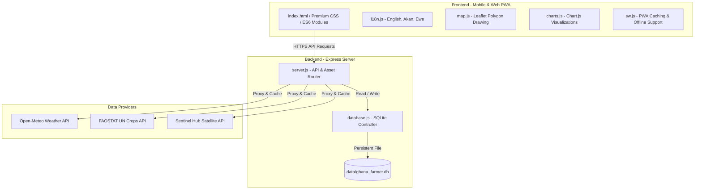

# Ghana Farmer Support Application - Design Specification

**Date:** 2026-05-23
**Status:** Approved by User

---

## 1. Goal & Context

The goal is to build a full-stack, mobile-first web application tailored to support Ghanaian smallholder farmers. The application integrates environmental and agricultural data from **Open-Meteo** (weather, soil moisture, evapotranspiration) and **FAOSTAT** (historical crop yields for Ghana) alongside a flexible **Sentinel Hub** satellite integration (to visualize crop health indices like NDVI). It offers a beautiful, interactive dashboard with offline capability (PWA) and multi-language support (English, Akan/Twi, and Ewe).

---

## 2. System Architecture

We employ a **Simple Integrated Monolith** architecture. A unified Node.js/Express application serves the responsive frontend and hosts lightweight API endpoints that interact with a local SQLite database and proxy third-party APIs.



---

## 3. Technology Stack

* **Frontend:** Modern Vanilla HTML5, CSS3 (premium glassmorphic styling, HSL variables, fluid layouts), and ES6 modular JavaScript.
  * **Leaflet.js:** Open-source interactive map rendering, polygon drawing, and coordinates management.
  * **Chart.js:** Fluid charts representing historical yields, precipitation, temperature, and NDVI trajectories.
  * **Workbox / Service Workers:** Client-side network interception to facilitate full offline operations.
* **Backend:** Node.js, Express.js.
* **Database:** SQLite (file-based) using the high-performance `better-sqlite3` driver.
* **Libraries:** `dotenv` for environment loading, `node-fetch` for backend HTTP queries.

---

## 4. Database Schema

Stored locally in `/Users/fred/Documents/VibeCoding/antigravity/ghana-farmer/data/ghana_farmer.db`.

```sql
-- Users Table
CREATE TABLE IF NOT EXISTS users (
  id INTEGER PRIMARY KEY AUTOINCREMENT,
  username TEXT UNIQUE NOT NULL,
  created_at DATETIME DEFAULT CURRENT_TIMESTAMP
);

-- Farms Table
CREATE TABLE IF NOT EXISTS farms (
  id INTEGER PRIMARY KEY AUTOINCREMENT,
  user_id INTEGER NOT NULL,
  name TEXT NOT NULL,
  geometry TEXT NOT NULL, -- GeoJSON String representing polygon
  created_at DATETIME DEFAULT CURRENT_TIMESTAMP,
  FOREIGN KEY (user_id) REFERENCES users(id) ON DELETE CASCADE
);

-- Weather Cache Table
CREATE TABLE IF NOT EXISTS weather_cache (
  farm_id INTEGER PRIMARY KEY,
  daily_data TEXT NOT NULL, -- Cached JSON string
  hourly_data TEXT NOT NULL, -- Cached JSON string
  cached_at DATETIME DEFAULT CURRENT_TIMESTAMP,
  FOREIGN KEY (farm_id) REFERENCES farms(id) ON DELETE CASCADE
);

-- FAOSTAT Crop Cache Table
CREATE TABLE IF NOT EXISTS faostat_cache (
  id INTEGER PRIMARY KEY AUTOINCREMENT,
  crop_name TEXT UNIQUE NOT NULL,
  data_payload TEXT NOT NULL, -- Cached JSON string
  cached_at DATETIME DEFAULT CURRENT_TIMESTAMP
);
```

---

## 5. API Routes

| Method | Endpoint | Payload / Query | Description |
|:---|:---|:---|:---|
| **GET** | `/api/users` | - | Lists all registered users (facilitates easy switching in prototype) |
| **POST** | `/api/users` | `{ username }` | Registers a new user |
| **GET** | `/api/farms` | `?user_id=X` | Retrieves saved farms for user X |
| **POST** | `/api/farms` | `{ user_id, name, geometry }` | Saves a new farm boundary polygon |
| **DELETE** | `/api/farms/:id` | - | Deletes a farm and its associated weather caches |
| **GET** | `/api/farms/:id/weather` | - | Retrieves Open-Meteo forecast (proxied and cached for 6 hours) |
| **GET** | `/api/farms/:id/satellite` | - | Retrieves NDVI vegetation time-series (proxied Sentinel Hub, fallback to mock) |
| **GET** | `/api/faostat/:crop` | - | Retrieves FAOSTAT statistics for the specified crop in Ghana (cached 7 days) |

---

## 6. Frontend Features & UX Design

### i. Premium Visual Aesthetics
* **Theme:** Forest & Earth Tech dashboard. Utilizes vibrant HSL accent variables, dark-mode default translucent background panels, glassmorphic blur effects (`backdrop-filter: blur(12px)`), and thin glowing borders (`border: 1px solid rgba(255, 255, 255, 0.08)`).
* **Animations:** Subtle transition timings on hover, state transitions (e.g. card expansion), and map interactions.
* **Layout:** Grid/Flexbox design. Responsive collapsible menu sidebar for farm selection, large central mapping pane, and dynamic dashboard cards on the right.

### ii. Multi-Language i18n
Supported languages:
* **English (en)**
* **Akan / Twi (ak)**
* **Ewe (ee)**

UI components read their labels from a unified client dictionary in `i18n.js`. Selecting a language immediately updates the text dynamically across all active layout widgets.

### iii. Offline Capability
* **Service Worker:** Intercepts frontend requests. Caches critical assets (`index.html`, CSS, JS, manifest).
* **LocalStorage:** Farms are synchronized locally to allow listing and navigating saved farms when completely offline.
* **Connection Sensor:** Employs an online/offline header indicator and disables live server fetching if connection is lost.

---

## 7. Testing & Verification

1. **Automated Integration Tests:**
   * Backend route validation verifying valid JSON inputs, HTTP codes, and database states.
   * Verify caching logic by asserting that consecutive `/weather` calls hit the database rather than making outbound calls.
2. **Manual Verification:**
   * Interactive boundary drawing on Leaflet.
   * Toggling language select buttons and confirming Akan and Ewe text injection.
   * Emulating offline status in DevTools to confirm asset retrieval via Service Worker.
